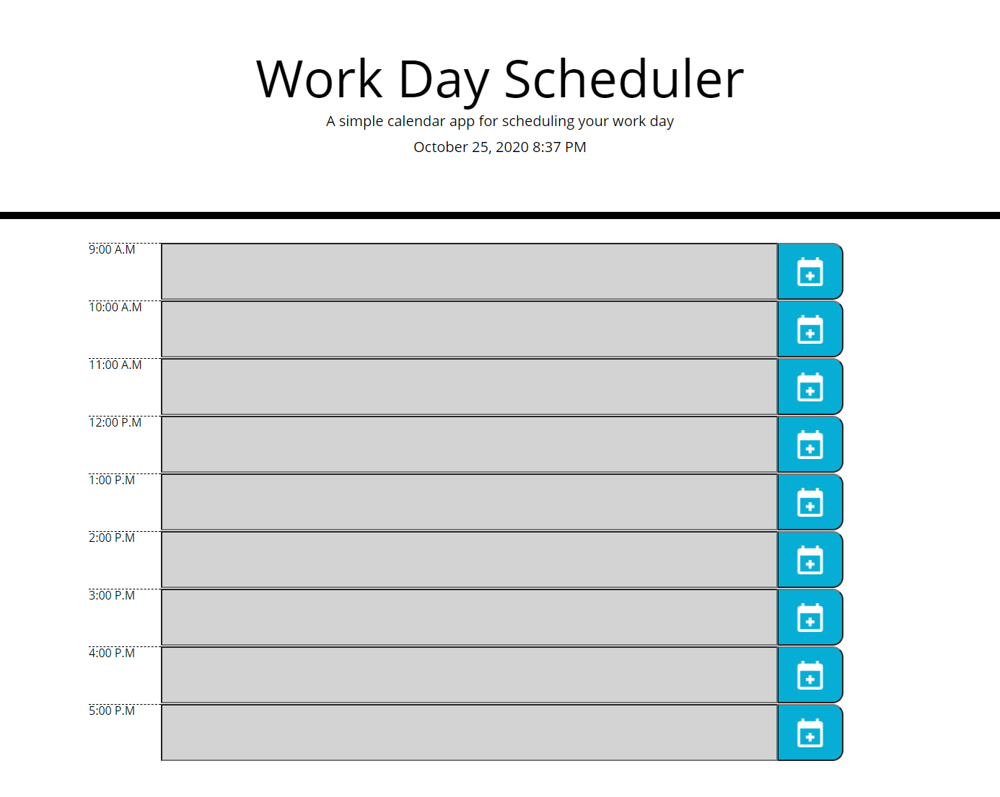

# 05 Third-Party APIs: Work Day Scheduler

## My Task
 My task for this assignment was to do the coding for a scheduling website.
 I had to first create timeblocks in the HTML for each time slot. 
 Then, I created event listeners for each button, and created if statements to store the users input value to local storage for each button, and also display that local storage value to the input box.
 After I had that working, I created code to run through each description class, and then pull the data-hour and compare it to current hour in time from Moment.Js, and assign colors to each time block accordingly for past present and future.

## Links

[Live Webpage](https://mli2950.github.io/Homework-5---Day-Scheduler/)  
[My Repository](https://github.com/mli2950/Homework-5---Day-Scheduler)

## Screenshots

